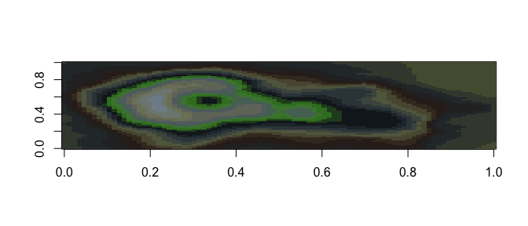

<!-- README.md is generated from README.Rmd. Please edit that file -->
Animated Palettes
=================

Installation
------------

``` r
devtools::install_github("Eomesodermin/animated")
```

Usage
-----

``` r
library("animated")

# See all palettes
names(animated_palettes)
#> [1] "A_Bugs_life" "Aladdin"
```

Palettes
--------

### Aladdin

``` r
animated("A_Bugs_life")
```


``` r
library("ggplot2")
ggplot(mtcars, aes(factor(cyl), fill=factor(vs))) +  geom_bar() +
  scale_fill_manual(values = animated("A_Bugs_life"))
```


``` r
pal <- animated("A_Bugs_life", 21, type = "continuous")
image(volcano, col = pal)
```


