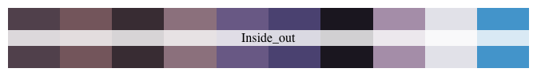
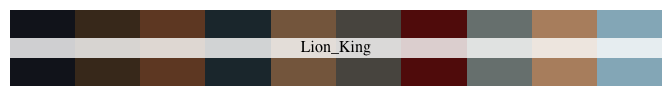
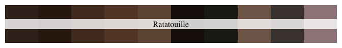

<!-- README.md is generated from README.Rmd. Please edit that file -->
Animated Palettes
=================

Installation
------------

``` r
devtools::install_github("Eomesodermin/animated", force = TRUE)
```

Usage
-----

``` r
library("animated")

# See all palettes
names(animated_palettes)
#> [1] "A_Bugs_life"  "Aladdin"      "Finding_Nemo" "Inside_out"   "Lion_King"   
#> [6] "Monsters_Inc" "Ratatouille"  "Up"
```

Palettes
--------

### A\_Bugs\_life

``` r
animated("A_Bugs_life")
```


### Aladdin

``` r
animated("Aladdin")
```


### Finding\_Nemo

``` r
animated("Finding_Nemo")
```


### Inside\_out

``` r
animated("Inside_out")
```



### Lion\_King

``` r
animated("Lion_King")
```



### Monsters\_Inc

``` r
animated("Monsters_Inc")
```


### Ratatouille

``` r
animated("Ratatouille")
```



### Up

``` r
animated("Up")
```


``` r
library("ggplot2")
ggplot(mtcars, aes(factor(cyl), fill=factor(vs))) +  geom_bar() +
  scale_fill_manual(values = animated("A_Bugs_life"))
```


``` r
pal <- animated("A_Bugs_life", 21, type = "continuous")
image(volcano, col = pal)
```


