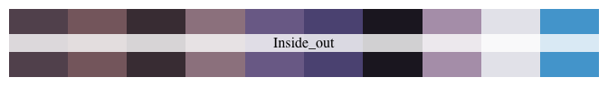

<!-- README.md is generated from README.Rmd. Please edit that file -->
Animated Palettes
=================

Recycled code from [Karthik Ram’s `wesanderson`
palette](https://github.com/karthik/wesanderson) with inspiration from
[DL Miller’s `beyonce` palette](https://github.com/dill/beyonce)

**Note**: Where as previously mentioned paletts used a different method
for generating themed color palettes. I have opted for a different
approach. I brief I used movie barcodes (in which every frame of a movie
is shrunk to a couple pixel wide line), I then took the top 10 (using a
k-means algorithm [palette generator](https://palettegenerator.com/))
most represented colors.

Using this approach I have generated color palettes that represent the
most dominant colors of a given movie.

However, I am not sure I like the results all that much, I am working on
implementing a better method for generating color palettes that better
refects the artisticly dominant colors of a movie. So please check back
at some point.

Installation
------------

``` r
devtools::install_github("Eomesodermin/animated", force = TRUE)
```

Usage
-----

``` r
# Load library
library("animated")

# List of all palettes currently available can be found using
names(animated_palettes)

# To call a specific palette use 
animated("Aladdin")

# All current palettes are n = 10
# to interpolate more colors for a specific palette use 
animated("Aladdin", 21, type = "continuous")
```

Palettes
--------


